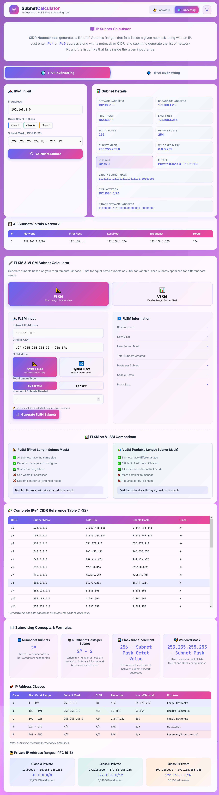
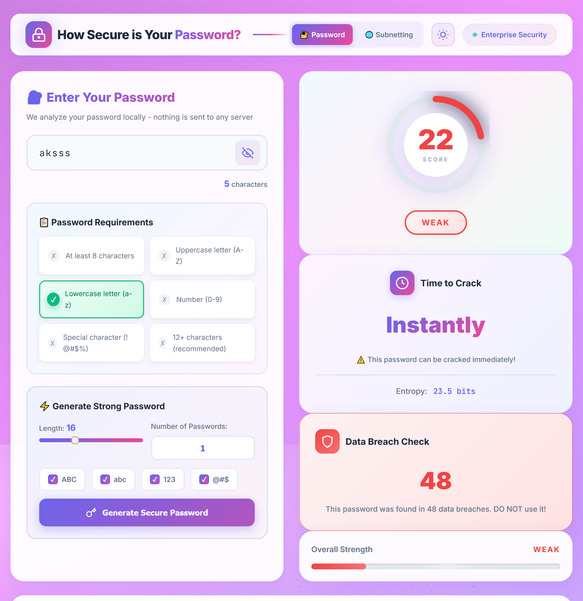

<div align="center">

  <h1>🛡️ Network & Security Suite</h1>

  <p>
    
    
    
    
  </p>
  
  <h3>
    A powerful toolkit for <span style="color: #2b95ff;">Network Engineering</span> & <span style="color: #ff4b4b;">Cyber Security</span>.
  </h3>

  <p>
    <a href="#-features">Features</a> •
    <a href="#-screenshots">Screenshots</a> •
    <a href="#-how-to-run">How To Run</a> •
    <a href="#-author">Author</a>
  </p>

  <br>

</div>

---

## 🧐 What is this?
This is an **All-in-One Utility** designed to simplify complex calculations for students and professionals. It features a seamless **Toggle Interface** to switch between two core modules:
1.  **Network Operations:** Advanced Subnetting (VLSM/FLSM).
2.  **Security Operations:** Password Strength & Breach Analysis.

---

## 🚀 Features

<table align="center">
  <tr>
    <td align="center" width="50%">
      <h3>🌐 IP Subnet Calculator</h3>
    </td>
    <td align="center" width="50%">
      <h3>🔐 Password Security Tool</h3>
    </td>
  </tr>
  <tr>
    <td>
      <ul>
        <li>✅ <strong>Dual Mode:</strong> VLSM & FLSM Support</li>
        <li>✅ <strong>Visuals:</strong> Dynamic Subnet Charts</li>
        <li>✅ <strong>Details:</strong> Network ID, Broadcast, & Host Range</li>
        <li>✅ <strong>Classful:</strong> Quick presets for Class A, B, C</li>
      </ul>
    </td>
    <td>
      <ul>
        <li>✅ <strong>Entropy Check:</strong> Real-time bit strength analysis</li>
        <li>✅ <strong>Crack Time:</strong> Estimates Brute-force time</li>
        <li>✅ <strong>Breach Database:</strong> Checks leaked passwords</li>
        <li>✅ <strong>Generator:</strong> Creates unhackable credentials</li>
      </ul>
    </td>
  </tr>
</table>

---

## 📸 Screenshots

<div align="center"> 
  
  
  <p><em>(Left: Subnet Calculator Interface | Right: Password Strength Analyzer)</em></p>
</div>

---

## 🛠️ Tech Stack

| Frontend | Logic | Styling |
| :---: | :---: | :---: |
|  |  |  |

---

## 💻 How to Run

You can run this project locally in 3 simple steps:

```bash
# 1. Clone the repository
git clone [https://github.com/YOUR-USERNAME/REPO-NAME.git](https://github.com/YOUR-USERNAME/REPO-NAME.git)

# 2. Navigate to directory
cd REPO-NAME

# 3. Open the file
# Simply double-click 'index.html' to launch in browser!
